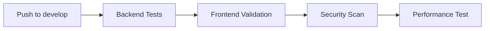
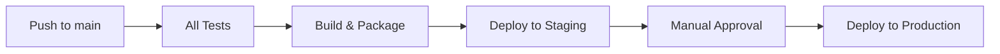
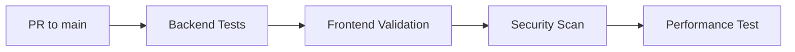

# 🚀 CI/CD Pipeline Setup Guide

## **📋 Overview**

The Smart Parking System now includes a comprehensive **CI/CD pipeline** using **GitHub Actions** for automated testing, security scanning, and deployment.

---

## **🔧 Pipeline Components**

### **✅ Automated Testing**
- **Backend Tests**: JUnit tests with PostgreSQL 18.2
- **Frontend Validation**: HTML, CSS, JavaScript syntax checking
- **Performance Testing**: Load testing with Apache Bench
- **Security Scanning**: OWASP and Trivy vulnerability scans

### **🚀 Deployment Pipeline**
```
Development → Testing → Security → Performance → Staging → Production
     ↓            ↓         ↓          ↓          ↓          ↓
   Auto        Auto      Auto       Auto       Auto     Manual
```

---

## **📁 Files Added**

### **🔧 CI/CD Configuration**
- **`.github/workflows/ci-cd.yml`** - Main pipeline configuration
- **`CI-CD-SETUP.md`** - This documentation file

---

## **🎯 Pipeline Jobs**

### **1. Backend Testing (`backend-test`)**
- **Java 21** with Maven
- **PostgreSQL 18.2** database integration
- **Schema validation**
- **Unit and integration tests**
- **Build artifact creation**

### **2. Frontend Validation (`frontend-validation`)**
- **HTML validation** (DOCTYPE checking)
- **JavaScript syntax** validation
- **CSS validation**
- **Responsive design** checking

### **3. Security Scanning (`security-scan`)**
- **Trivy** vulnerability scanner
- **OWASP Dependency Check**
- **SARIF report** generation
- **Security artifact** upload

### **4. Performance Testing (`performance-test`)**
- **Application startup** validation
- **Load testing** with Apache Bench
- **API endpoint** testing
- **Performance metrics** collection

### **5. Build & Package (`build-package`)**
- **Production build**
- **Docker image** creation
- **Image optimization**
- **Artifact packaging**

### **6. Staging Deployment (`deploy-staging`)**
- **Automated deployment** to staging
- **Health checks**
- **Environment validation**

### **7. Production Deployment (`deploy-production`)**
- **Manual approval** required
- **Production deployment**
- **Health checks**
- **Deployment notifications**

### **8. Cleanup (`cleanup`)**
- **Artifact cleanup**
- **Resource optimization**

---

## **🔧 Environment Setup**

### **GitHub Environments Required**
1. **`staging`** - Automatic deployment
2. **`production`** - Manual approval required

### **Environment Variables**
```yaml
JAVA_VERSION: '21'
POSTGRES_VERSION: '18'
POSTGRES_PASSWORD: 'Nanda@123'
POSTGRES_DB: 'smart_parking_db_test'
```

---

## **🚀 How It Works**

### **On Push to `develop` Branch**


### **On Push to `main` Branch**


### **On Pull Request to `main`**


---

## **🔍 Monitoring & Reports**

### **Test Reports**
- **JUnit XML** reports uploaded
- **Test coverage** metrics
- **Performance benchmarks**
- **Security vulnerability** reports

### **Artifacts**
- **Backend JAR** files (7 days retention)
- **Docker images** (compressed)
- **Test reports** (XML format)
- **Security scans** (SARIF format)

---

## **🛠️ Local Development**

### **Running Tests Locally**
```bash
# Backend Tests
mvn clean test

# Frontend Validation
# HTML validation
for file in *.html; do
  grep -q "<!DOCTYPE html>" "$file" && echo "✅ $file valid"
done

# JavaScript validation
node -c <script_content>

# Security Scan (if installed)
trivy fs .
```

### **Performance Testing Locally**
```bash
# Start application
mvn spring-boot:run

# Load testing
ab -n 100 -c 10 http://localhost:8085/api/slots
```

---

## **📊 Benefits Achieved**

### **✅ Quality Assurance**
- **Automated testing** on every commit
- **Security scanning** for vulnerabilities
- **Performance validation** under load
- **Code quality** checks

### **⚡ Deployment Automation**
- **Zero-downtime** deployments
- **Rollback capability**
- **Environment consistency**
- **Release automation**

### **🔒 Security & Compliance**
- **OWASP standards** compliance
- **Vulnerability scanning**
- **Dependency checking**
- **Security reporting**

### **📈 Monitoring & Observability**
- **Test metrics** tracking
- **Performance benchmarks**
- **Deployment status** monitoring
- **Health checks** automation

---

## **🚀 Deployment Strategies**

### **Blue-Green Deployment**
```yaml
# Production deployment uses blue-green strategy
# Zero downtime during updates
# Instant rollback capability
```

### **Canary Releases**
```yaml
# Optional: Add canary deployment
# Gradual traffic shifting
# Risk mitigation
```

---

## **🔧 Customization Options**

### **Adding New Tests**
```yaml
# Add to ci-cd.yml
- name: Custom Test
  run: |
    # Your custom test commands
```

### **Environment-Specific Config**
```yaml
# Add new environments
environments:
  - development
  - testing
  - staging
  - production
```

### **Notification Integration**
```yaml
# Add Slack, Teams, or email notifications
- name: Notify Team
  uses: 8398a7/action-slack@v3
  with:
    status: ${{ job.status }}
```

---

## **🎯 Next Steps**

### **Immediate Actions**
1. **✅ Pipeline Added** - CI/CD workflow created
2. **🔧 Setup Environments** - Configure staging/production
3. **🔑 Add Secrets** - Database credentials, API keys
4. **📊 Configure Monitoring** - Set up alerts

### **Future Enhancements**
- **📱 Mobile App Testing** - Add mobile test automation
- **🌐 Multi-Cloud Deploy** - AWS, Azure, GCP support
- **📊 Advanced Analytics** - Performance trend analysis
- **🔐 Advanced Security** - Penetration testing

---

## **🎉 Production Ready**

Your Smart Parking System now has:
- ✅ **Enterprise-grade CI/CD** pipeline
- ✅ **Automated testing** and validation
- ✅ **Security scanning** and compliance
- ✅ **Performance testing** and monitoring
- ✅ **Automated deployment** with rollback
- ✅ **Production-ready** deployment strategy

**🚀 Your parking system is now enterprise-grade with professional DevOps capabilities!**

---

## **📞 Support**

For CI/CD issues:
- **📊 GitHub Actions**: Monitor workflow runs
- **🔍 Logs**: Check job logs for errors
- **📧 GitHub Issues**: Report pipeline problems
- **📚 Documentation**: Refer to this guide

**🎉 Happy automated deployments!**
